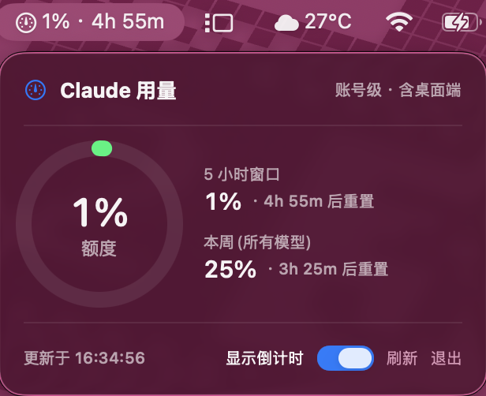

# ClaudeMeter

一个轻量的 macOS 菜单栏小工具，让你**随时看到 Claude 订阅额度还剩多少**。

它常驻菜单栏，直接显示当前 **5 小时窗口**的用量百分比和距离重置的倒计时；点开面板还能看到本周额度。数据与终端 `/usage` 命令、桌面端完全一致——因为它读的就是同一个账号级接口，覆盖你所有设备的消耗。

- 🪶 **轻巧**：原生 Swift + SwiftUI，无依赖，体积仅几 MB
- 📊 **准确**：账号级真实用量，和 `/usage` 一模一样
- 🔕 **省心**：纯菜单栏常驻，无 Dock 图标，低频刷新不打扰
- 🔒 **零配置**：复用本机 Claude Code 的登录态，不需要填任何密钥



> 📦 **直接下载**：前往 [Releases](https://github.com/aright8-sys/ClaudeMeter/releases/latest) 下载打包好的 `ClaudeMeter.app`，或按下方说明自行构建。

> ### ⚠️ 免责声明
>
> 本项目为个人作品，**与 Anthropic 无关，未获其授权或背书**。它使用的是一个
> **非公开的内部接口**（Claude Code 自身为 `/usage` 命令调用的同一接口），该接口
> 可能在任何时候变更或失效，导致本工具无法工作。
>
> 本工具**不收集、不上传、不存储**你的任何数据；账号登录态仅在运行时从本机钥匙串
> 读取，用于直接向 Anthropic 官方接口查询用量，绝不外发到第三方。
>
> 仅供个人学习与自用，**请自行评估并承担使用风险**。

## 工作原理

复用本机 Claude Code 在 macOS 钥匙串里的 OAuth 登录态，调用和 `/usage` 同一个
接口 `GET https://api.anthropic.com/api/oauth/usage`，拿到的是**账号级真实用量**
——和终端 `/usage`、桌面端完全一致，含所有设备的消耗：

- **5 小时窗口**利用率 + 重置时间
- **本周(所有模型)**利用率 + 重置时间

### 钥匙串授权

首次运行时 macOS 会弹窗询问是否允许 ClaudeMeter 读取 `Claude Code-credentials`，
点「始终允许」即可（之后不再提示）。token 由 Claude Code 自己刷新并写回钥匙串，
ClaudeMeter 每次读最新的；登录过期时面板会提示重新登录。

## 构建与运行

需要 macOS 14+ 和 Swift 工具链（Xcode 或 Command Line Tools 即可，无需打开 Xcode）。

```bash
./build-app.sh            # 编译并打包成 ClaudeMeter.app
open ClaudeMeter.app      # 运行
cp -r ClaudeMeter.app /Applications/   # 安装（可选）
```

开发调试：

```bash
swift build               # 仅编译
swift run                 # 直接运行（会以普通进程出现在 Dock，正式包不会）
```

## 使用

启动后点击菜单栏的仪表图标：

- 环形进度 = 官方 5 小时窗口利用率（与 `/usage` 一致）
- 5 小时窗口 / 本周利用率 + 各自重置倒计时

刷新策略：官方用量每 600 秒拉一次，打开面板时也即时拉一次（60 秒内刚刷过则跳过，
避免限流）；另有 30 秒轻量定时器只更新倒计时。

## 目录结构

```
Sources/ClaudeMeter/
  ClaudeMeterApp.swift   App 入口 + MenuBarExtra
  AppState.swift         状态管理、刷新调度、派生值
  UsageAPI.swift         钥匙串读 token + 调官方用量接口
  ProgressRing.swift     环形进度组件
  PopoverView.swift      弹出面板 UI
  Format.swift           显示格式化
build-app.sh             打包脚本（写入 LSUIElement）
```
