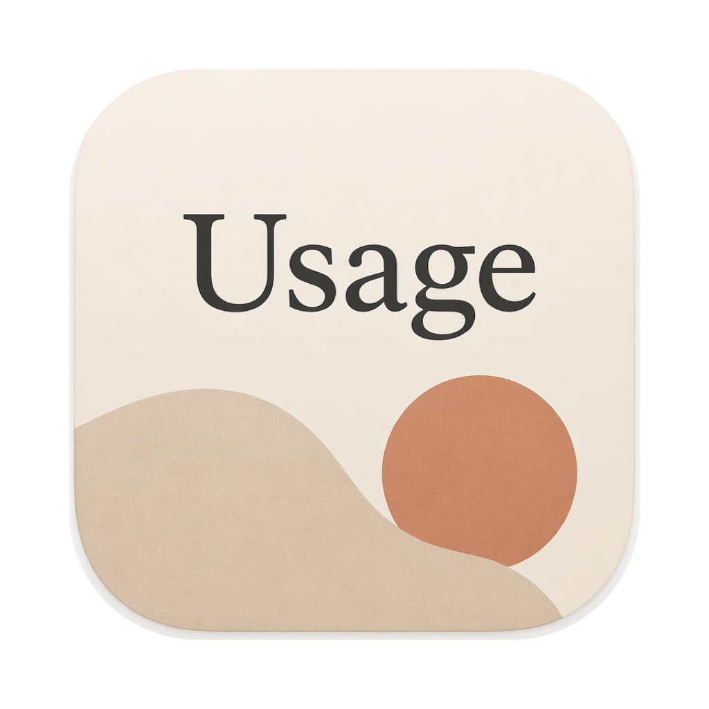

<p align="center">
  
</p>

<h1 align="center">ClaudeMeter</h1>

<p align="center">
  一个轻量的 macOS 菜单栏小工具：<strong>随时看 Claude 订阅额度，并统计你各家 AI 编程工具的用量与花费</strong>。
</p>

<p align="center">
  <strong>中文</strong> ·
  <a href="README.en.md">English</a>
</p>

<p align="center">
  
  
  
</p>

<p align="center">
  
</p>

它常驻菜单栏，直接显示当前 **5 小时窗口**的用量百分比和重置倒计时；点开面板还能看到本周额度，以及**近 30 天的用量记账**——按天、按模型统计 token 与等效美元花费，可在 Token / 金额 间切换。

- 🪶 **轻巧**：原生 Swift + SwiftUI，无第三方依赖，体积仅几 MB
- 📊 **额度监测**：截获 Claude Code 状态栏数据，5 小时 / 本周窗口一目了然
- 🧾 **多工具记账**：Claude Code、Codex 本地日志 + Cursor 云端用量，统一按天/按模型算账
- 💸 **金额估算**：按官方 API 价目折算"等效花费"，Token / 金额一键切换
- 🖱️ **交互**：每日柱状图鼠标悬停即时显示当天数据

> 📦 **直接下载**：前往 [Releases](https://github.com/aright8-sys/ClaudeMeter/releases/latest) 下载打包好的 `ClaudeMeter.app`，或按下方说明自行构建。

## 🆕 更新日志

### v2.0.0

- **额度监测改用 statusline 截获**：不再读取钥匙串 token、不再调用 Anthropic 私有接口。改为在 Claude Code 的 `statusLine.command` 上装一个透明包装脚本，截获其每次渲染状态栏时输出的 `rate_limits`。更稳、不碰登录态；与 [vibe-usage](https://github.com/vibe-cafe/vibe-usage-app) 等同类工具可共存。
- **新增"记账"功能**：扫描本地会话日志，按天 + 模型聚合 token 用量，纯本地：
  - **Claude Code** — `~/.claude/projects/**/*.jsonl`
  - **Codex** — `~/.codex/{sessions,archived_sessions}/**/*.jsonl`
- **新增 Cursor 用量**：从 Cursor 本地数据库读登录态，联网拉取 `cursor.com` 的云端用量并纳入记账（**这是唯一会联网的数据源**）。
- **Token / 金额 切换**：金额按官方 API 价目折算"等效 API 价值"（输入/输出 + 缓存读 ×0.1，不计缓存写，口径对齐 vibe-usage）。
- **每日柱状图**：鼠标悬停即时弹出当天日期与数值，并高亮当前柱。
- 移除旧的 `UsageAPI.swift`（OAuth 接口方式）。

## ⚠️ 免责声明与数据说明

> 本项目为个人作品，**与 Anthropic、OpenAI、Cursor 均无关，未获其授权或背书**。
> 它依赖一些**非公开/逆向的数据格式与接口**（Claude Code 的 statusline 负载、各工具的本地日志、
> Cursor 的 dashboard 接口），这些都可能在任何时候变更或失效，导致功能无法工作。
>
> **数据流向**：
> - **额度 + Claude/Codex 记账**：全程纯本地，不联网、不上传。
> - **Cursor 记账**：会读取本机 Cursor 的登录态，并**联网请求 `cursor.com`** 拉取你账号的云端用量。
>   仅用于在本机展示，绝不外发到任何第三方。
>
> **金额仅供参考**：显示的是按 API 价目折算的"等效价值"，**不是你真实支付的金额**
> （订阅用户为固定月费）。其中 Cursor 的 `auto`/`composer` 等内部模型采用近似价，非官方报价。
>
> 仅供个人学习与自用，**请自行评估并承担使用风险**。

## 工作原理

### 额度（statusline 截获）

Claude Code 每次渲染状态栏时，会把一段 JSON（含 `rate_limits`）通过 stdin 喂给你配置的
`statusLine.command`。ClaudeMeter 在首次「启用」时，把一个透明包装脚本装进该命令（脚本写在
`~/.claudemeter/`），它做两件事：

1. 把其中的 `rate_limits`（5 小时 / 本周窗口）切片写到 `~/.claudemeter/claude-rate-limits.json`；
2. 用**原封不动**的 stdin 调用你原来的 statusline 命令，所以现有状态栏照常工作、无感知。

安装幂等、自愈，随时可一键关闭恢复。

### 记账（本地日志 + Cursor 云端）

各 AI 编程工具都会在本地写会话日志，每条 assistant 消息自带 token 用量。ClaudeMeter 扫描这些日志，
按天 + 模型聚合，并按官方价目折算金额：

| 来源 | 数据位置 | 是否联网 |
| --- | --- | --- |
| Claude Code | `~/.claude/projects/**/*.jsonl` | 否 |
| Codex | `~/.codex/{sessions,archived_sessions}/**/*.jsonl` | 否 |
| Cursor | 本地 `state.vscdb` 取 token → 请求 `cursor.com` | **是** |

## 构建与运行

需要 macOS 14+ 和 Swift 工具链（Xcode 或 Command Line Tools 即可，无需打开 Xcode）。

```bash
./build-app.sh            # 编译并打包成 ClaudeMeter.app
open ClaudeMeter.app      # 运行
cp -r ClaudeMeter.app /Applications/   # 安装（可选）
```

开发调试：

```bash
swift build               # 仅编译
swift run                 # 直接运行
```

## 使用

启动后点击菜单栏的仪表图标：

- **额度**：环形进度 = 5 小时窗口利用率；下方列出 5 小时 / 本周利用率 + 各自重置倒计时。
  首次需在面板点「启用」装一次 statusline 钩子，然后在 Claude Code 里发一条消息触发状态栏刷新即可。
- **记账**：近 30 天用量，右上角 Token / 金额 切换；每日柱状图悬停看当天数据，下方按模型排名。

## 目录结构

```
Sources/ClaudeMeter/
  ClaudeMeterApp.swift   App 入口 + MenuBarExtra
  AppState.swift         状态管理、刷新调度、派生值
  StatuslineHook.swift   安装/卸载 statusline 包装脚本
  RateLimitReader.swift  读截获文件，解析额度窗口
  UsageHistory.swift     扫描本地日志 + 聚合 + 价目
  CursorReader.swift     读 Cursor token + 联网拉云端用量（SQLite + HTTP）
  HistoryView.swift      记账面板 UI（Token/金额、柱状图、分模型）
  ProgressRing.swift     环形进度组件
  PopoverView.swift      弹出面板 UI
  Format.swift           显示格式化
build-app.sh             打包脚本（写入 LSUIElement）
```

## 许可证

[MIT](LICENSE)
